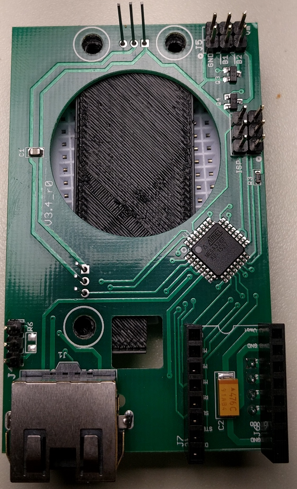

| step | Photo |
| ---- | ----- |
| Gather a PCB assembly, 3d printed soldering jig (optional), 2 light sensors, and a [pololu A4988 stepper driver][1]* |  |
| Insert both light sensors into the bottom of the PCB.  Note the dome direction and the silkscreened outline on the PCB for orientation. |  |
| Fit the soldering jig over the PCB to hold the light sensors in place and solder them to the PCB. |  |
| Insert the stepper driver onto the PCB.  The driver is directional so use the photo for orientation or make sure the pin labels match. |  |
| Trim the light sensor leads to length.  |  |
| Trim the inside tab off of the inside of the RJ45 port.  This step is important for laser alignment.  DO NOT SKIP THIS STEP.  |  |
| Power up the board (plug in the RJ45 cable to the mainboard) and adjust the stepper driver to 400mA according to the boards [instructions][1] |   |
| Program the board with the file ```OD_board\Production_files\firmware.hex``` |    |

*Note: you may use a cheaper generic, but be sure to follow the 3rd praty instructions for setting current as the sense resistors can be different for generic drivers.

[1]: https://www.pololu.com/category/156/a4988-stepper-motor-driver-carriers