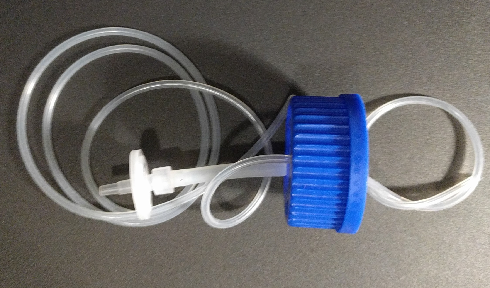
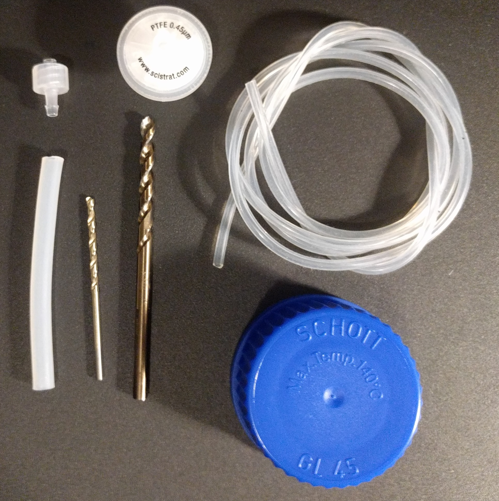
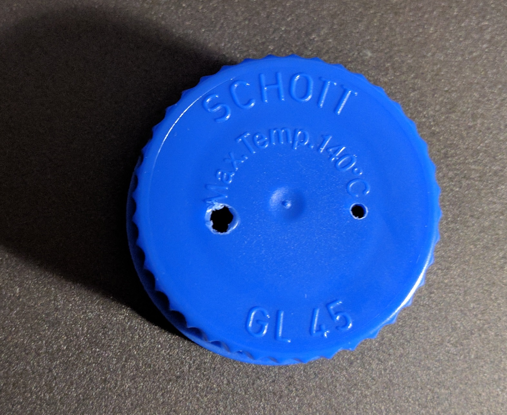
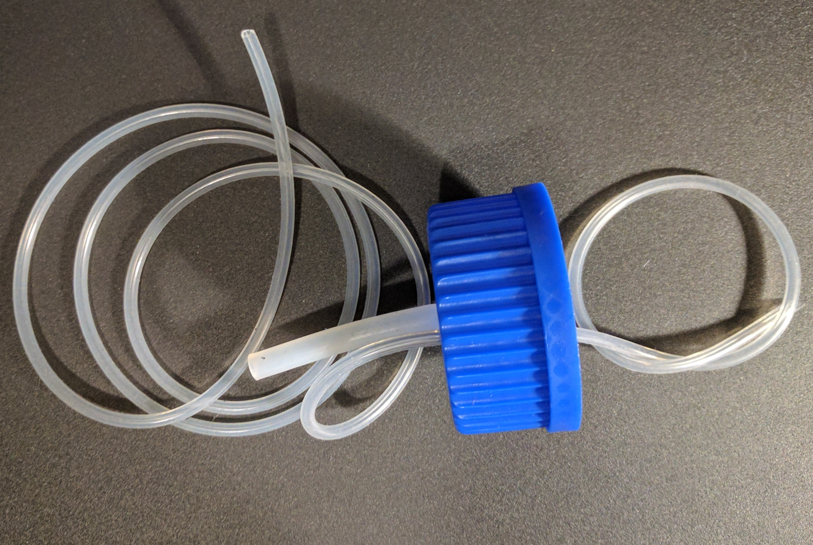

| step | Photo |
| ---- | ----- |
| You'll need a Drill with 3/32" (2.5mm) and 3/16"(5mm) bits, a GL45 cap, a couple inches of 1/8ID tube, 1/16ID tube, a 0.45 &mu;m PTFE syringe filter, and an 1/8" barb to male luer lock adapter.   |  |
| Drill two holes, one of each size in the cap.  Be careful to locate the holes inside of the rim sealing area.  It may be easier to start with two small holes and expand one. |  |
| Cut the tubing at a 45&deg; angle and insert the tubing, making sure that the 1/16" tubing is inserted far enough to reach the bottom of the bottle.  |  |
| Insert the 1/8" luer-barb fitting and attach the syringe filter. |  |
